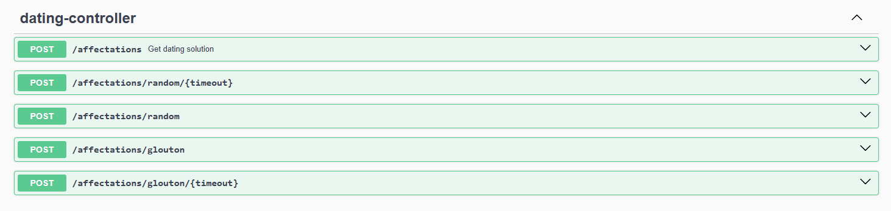

# Dépôt du projet de l'équipe `les gros jéson` #

<!-- Supprimez les exemples dont vous n'avez pas besoin, gardez la -->
<!-- structure générale du document et répondez aux questions posées -->

## Liste des membres ##

- nom / prénom / groupe
- Bruson Paul DWM2
- Cheklat Ahmed-Massi DACS
- Etique Kevin DWM2
- Mellano Louka IL1
- Naiegon Adrien IL2
- Netange Clément DWM2
- Quilliec Amaury DWM2
- Reveillard Fabio IL1


## URL ##

- git : https://github.com/EtiqueKevin/ServiceDating
- de l'application finale : http://servicedating.paul-bruson.fr/

##  Partie application Web ##

### Liste des numéros de fonctionnalités implantées ###

<!-- Énumération de la liste, commentaires au besoin -->

### Commentaires additionnels ###

<!-- Indiquez toutes les données utiles au test (identifiants, mots de -->
<!-- passes, données déjà saisies etc...), décrivez les éventuelles -->
<!-- fonctionnalités additionnelles -->

Il y avait du code que voilà :

```
git push -u origin master
```

Et une image aussi :


##  Partie Front-end ##

### Fonctionnalité de base ###


| Fonctionnalité | Type  | Fait ou non |
|----------------|-------|-----------|
| 1              | Basique | ✅         |
| 2              | Avancé | ✅         |
| 3              | Avancé | ✅         |
| 4              | Admin | ✅         |
| 5              | Admin | ✅         |
| 6              | Admin | ✅         |
| 7              | Admin | ✅         |
| 8              | Avancé / Admin |✅   |
| 9              | Avancé | ✅         |
| 10             | Admin |     ❌      |

### Fonctionnalité de avancé ###

| Fonctionnalité | Type    | Fait ou non    |
|----------------|---------|----------------|
| 11             | Basique | ✅              |
| 14             | Basique | 🟠 partiellement |


##  Partie Optimisation ##

### IA ###

Pour commencer la partie IA, nous devions d'abord convertir les fichiers CSV en objet java pour pouvoir les manipuler plus facilement et pour que ce soit compatible avec l'API.
Pour sela, nous avons implémenté les méthodes toCsv et fromCsv dans les classes DatingProblem et DatingSolution avec les tests unitaires qui vont avec.

### API ###
Pour permettre à l'application d'utiliser les algorithmes de recommandation, nous avons mis en place une API Spring Boot.
Cet API permet d'envoyer en entrée des clients et des salariés et de recevoir en sortie le salarié le plus adapté à chaque client, le tout en format JSON.



Pour réaliser cette API, nous nous sommes d'abord mis d'accord sur l'architecture des fichiers.
Nous avons séparé les classes en 6 packages :
- controllers
- DTOs
- entities
- interfaces
- mappers
- services

Les controleurs sont la première porte de l'API, ils reçoivent les requêtes HTTP et les redirigent avec les DTO.
Les DTO ou Data Transfer Object sont des classes qui permettent de transférer des données Json du client au serveur et inversement.
Les mappers permettent de convertir les DTO en entités et inversement.
Les entités sont les classes qui représentent les objets nécessaires au bon fonctionnement de l'API.
Les services sont les classes qui contiennent les algorithmes de recommandation.
Et enfin, les interfaces sont les classes qui permettent de définir des méthodes et des enums.

L'avantage de Spring Boot est que beaucoup de choses se font toutes seuls, ce qui nous a permis de gagner du temps.
Par exemple, les mappers sont juste des interfaces où l'on décrit les attributs des classes et Spring Boot se charge de les implémenter.
Il est également possible de les personaliser si besoin, mais le plus gros du travail est déjà fait.
D'un autre côté, si on ne maitrise pas bien Spring Boot, et que ça ne fonctionne pas, il est difficile de comprendre vu que tout est fait automatiquement.

##  Déploiement ##

Pour cette partie, nous avons suivi l'approche :

- les explications...
- ...de ce qu'on a fait

## Partie Backend Web

Voici uniquement les routes exposées.

### API AUTH

> POST /signin[/]
>
>> Authentifie un utilisateur
>>
>> En-tête de la requête (Header) :

| nom attribut | type   | description                   |
|--------------|--------|-------------------------------|
| Authorization Basic |  | email et mot de passe |

--------------------------------------

> POST /register[/]
>
>> Creation de compte
>>
>> Body :

| nom attribut | type   | description                   |
|--------------|--------|-------------------------------|
| email        | string | email                         |
| mdp          | string | mot de passe                  |
| name         | string | nom de l'user                 |
| surname      | string | nom de famille de l'user      |
| surname      | string | nom de famille de l'user      |
| phone        | string | numero de telephone de l'user |

--------------------------------------

### API GESTION

> POST /utilisateur[/]
>
>> Creation compte d'un salarié 
>>
>> Body :

| nom attribut | type   | description                   |
|--------------|--------|-------------------------------|
| email        | string | email                         |
| mdp          | string | mot de passe                  |
| name         | string | nom de l'user                 |
| surname      | string | nom de famille de l'user      |
| surname      | string | nom de famille de l'user      |
| phone        | string | numero de telephone de l'user |

--------------------------------------


> GET /besoins[/]
>
>> Permet de récupérer tous les besoin de tous les clients
>>

> [!WARNING]
> il faut etre connecté en tant qu'Admin

--------------------------------------

> GET /users/besoins[/]
>
>> Permet de récupérer tous les besoin d'un utilisateur
>> On récupère l'id de l'utilisateur via son token JWT

> [!NOTE]
> il faut etre connecté en tant que client

--------------------------------------


> POST /besoins[/]
>
>> Permet de créer un besoin
>> On récupère l'id de l'utilisateur via son token JWT

> [!NOTE]
> il faut etre connecté en tant que client
>

| nom attribut  | type   | description         |
|---------------|--------|---------------------|
| competence_id | string | id de la competence |
| description   | string |                |

--------------------------------------

> PUT /besoins/{id}[/]
>
>> Permet de modifier un besoin
>> On récupère l'id de l'utilisateur via son token JWT

> [!NOTE]
> il faut etre connecté en tant que client

> [!IMPORTANT]
> Il faut que ce soit le besoin du client qui veut modifier


| nom attribut  | type   | description         |
|---------------|--------|---------------------|
| competence_id | string | id de la competence |
| description   | string |                |

--------------------------------------

> GET /salaries[/]
>
>> Permet d'afficher tous les salaries
>>

> [!WARNING]
> il faut etre connecté en tant qu'Admin
> 
--------------------------------------

> GET /competences[/]
>
>> Permet de récupérer toutes les compétences
>> 


--------------------------------------

> GET /competences/{id}[/]
>
>> Permet de récupérer une compétence via son id renseigné dans la query
>>

--------------------------------------


> POST /competences[/]
>
>> Permet de creer une compétence
>>

> [!WARNING]
> il faut etre connecté en tant qu'Admin

| nom attribut | type   | description           |
|--------------|--------|-----------------------|
| name         | string | nom de la description |
| description  | string |                       |
--------------------------------------

> PUT /competences/{id}[/]
>
>> Permet de creer une compétence
>>

> [!WARNING]
> il faut etre connecté en tant qu'Admin

| nom attribut | type   | description           |
|--------------|--------|-----------------------|
| name         | string | nom de la description |
| description  | string |                       |

--------------------------------------

> DELETE /competences/{id}[/]
>
>> Permet de creer une compétence
>>

> [!WARNING]
> il faut etre connecté en tant qu'Admin
