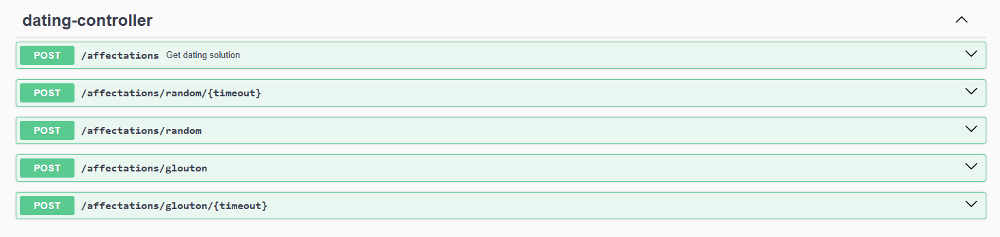

# Dépôt du projet de l'équipe xxx #

<!-- Supprimez les exemples dont vous n'avez pas besoin, gardez la -->
<!-- structure générale du document et répondez aux questions posées -->

## Liste des membres ##

- nom / prénom / groupe
- Bruson Paul DWM2
- Cheklat Ahmed-Massi DACS
- Etique Kevin DWM2
- Mellano Louka IL1
- Naiegon Adrien IL2
- Netange Clément DWM2
- Quilliec Amaury DWM2
- Reveillard Fabio IL1


## URL ##

- git : https://github.com/EtiqueKevin/ServiceDating
- de l'application finale : http://servicedating.paul-bruson.fr/acceuil

##  Partie application Web ##

### Liste des numéros de fonctionnalités implantées ###

<!-- Énumération de la liste, commentaires au besoin -->

### Commentaires additionnels ###

<!-- Indiquez toutes les données utiles au test (identifiants, mots de -->
<!-- passes, données déjà saisies etc...), décrivez les éventuelles -->
<!-- fonctionnalités additionnelles -->

Il y avait du code que voilà :

```
git push -u origin master
```

Et une image aussi :


##  Partie Optimisation ##


### API ###
Pour permettre à l'application d'utiliser les algorithmes de recommandation, nous avons mis en place une API Spring Boot.
Cet API permet d'envoyer en entrée des clients et des salariés et de recevoir en sortie le salarié le plus adapté à chaque client, le tout en format JSON.




##  Déploiement ##

Pour cette partie, nous avons suivi l'approche :

- les explications...
- ...de ce qu'on a fait
